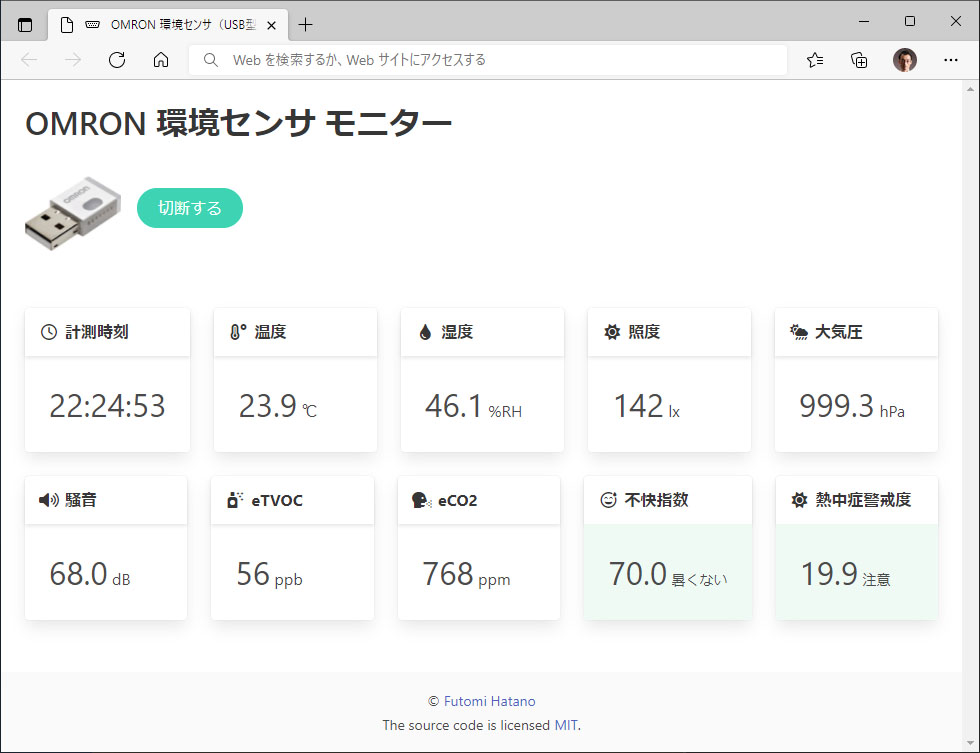

OMRON 環境センサ モニター
================

OMRON 環境センサ モニターは、[Web Serial API](https://wicg.github.io/serial/) を使って [OMRON 環境センサ USB型 (2JCIE-BU)](https://www.omron.co.jp/ecb/product-detail?partNumber=2JCIE-BU)に USB シリアルで接続し、センサー計測値をブラウザー上に表示します。

## 動作ブラウザー

このウェブアプリは、[Web Serial API をサポートしたブラウザー](https://caniuse.com/web-serial)で動作します。2021 年 11 月現在、以下のブラウザーで動作します。

- Chrome (PC 版)
- Edge
- Opera

## 利用方法

まず、[OMRON 環境センサ USB型 (2JCIE-BU)](https://www.omron.co.jp/ecb/product-detail?partNumber=2JCIE-BU) を PC の USB ポートに挿してください。

[OMRON 公式ページ](https://www.omron.co.jp/ecb/product-detail?partNumber=2JCIE-BU)より、USB ドライバーをダウンロードして PC にインストールしてください。

本リポジトリのディレクトリをローカルに保存し、index.html をブラウザーにドロップしてください。または、ディレクトリをウェブサイトにアップロードして index.html にアクセスしてください。なお、SSL ページでないと動作しませんので注意してください。

## サンプル

こちらのページでサンプルをご覧になれます。
- https://www.html5.jp/html5-omron-2jcie-bu/index.html

## 履歴

- 2021-11-11
    - リリース